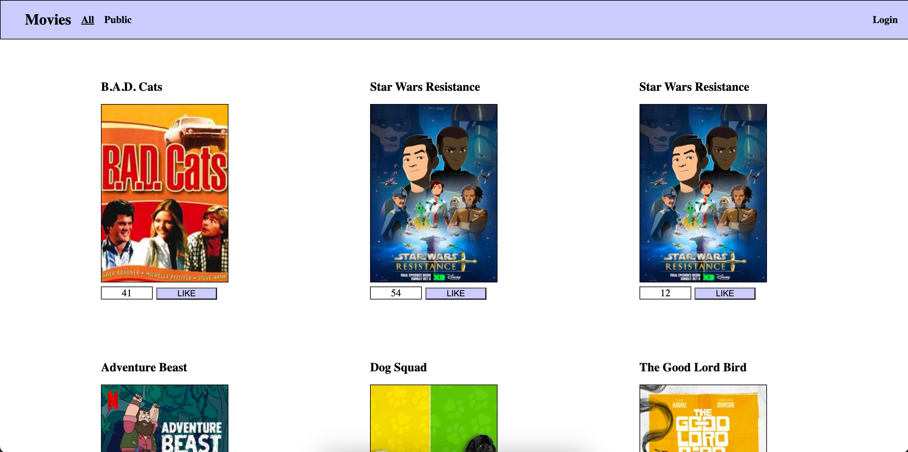

# Movies Explorer Firebase

A Movies explorer featuring authentication, users, error handling, movie browsing and favourites with a panel for syncing movies to database.



## Requires

A `configurations.js` file in the `js` folder, which contains the following:

```js
// The configuration of the web app as configurations.js

// The firebase configuration object from firebase
const firebaseConfig = {};

// Firebase initialization
firebase.initializeApp(firebaseConfig);
const db = firebase.firestore();

// Global helper function q which does a query selector
function q(incoming) { return document.querySelector(incoming); };

// SYSTEM_CONFIG holds static configuration variables that are used throughout the app coming from this global configuration
const SYSTEM_CONFIG = {
  // Static variables which hold collection names, the admin user uid for the frontend, and the api url
  ADMIN_USER: "", // Simple redirecting for an uid of a user allowed to access the syncing page
  MOVIE_COLLECTION: "", // Collection name for movies
  FAVOURITES_COLLECTION: "", // Collection name for favourites
  API_BASE_MOVIES_URL: "", // API endpoint for movies to pull

  // Links to remove static linking in the webapp, using from configuration for more control
  PROFILE_PAGE_LINK: "",
  LOGIN_PAGE_LINK: "",
  NULL_PAGE_LINK: ""
};

```
